<div align="center">

# 🛠️ TechTrackers

### A role-based technical-support ticketing platform for logging, assigning, tracking, and resolving IT issues.

_Staff raise issues → the system assigns technicians → progress is tracked in real time → reports close the loop._

[](https://dotnet.microsoft.com/)
[](https://react.dev/)
[](https://learn.microsoft.com/ef/core/)
[](https://www.microsoft.com/sql-server)
[](https://learn.microsoft.com/aspnet/core/signalr/introduction)
[](https://swagger.io/)
[](#-license)
[](#-contributing)

</div>

---

## 📑 Table of Contents

- [Overview](#-overview)
- [Features](#-features)
- [Screenshots](#-screenshots)
- [Tech Stack](#-tech-stack)
- [Architecture](#-architecture)
- [Folder Structure](#-folder-structure)
- [Data Model](#-data-model)
- [Getting Started](#-getting-started)
- [Configuration](#-configuration)
- [API Reference](#-api-reference)
- [Deployment](#-deployment)
- [Roadmap](#-roadmap)
- [Contributing](#-contributing)
- [License](#-license)

---

## 🔎 Overview

**TechTrackers** is a full-stack IT service-desk application. Employees ("Staff") log technical issues, which the system captures as **logs** (tickets). Administrators and Heads of Department triage and assign these logs to **technicians**, who work them to resolution while collaborating with peers and chatting with reporters in real time. SLA timers, escalations, and a suite of management reports keep the whole pipeline accountable.

The project is split into two independently runnable apps:

| App | Folder | Role |
|-----|--------|------|
| **Web** | `Techtrackers.Web/` | React single-page app — the entire user interface |
| **API** | `TechTrackers.API/` | ASP.NET Core 8 Web API — business logic, data access, real-time hub |

### Who it's for

- **Staff** — log issues and follow them to resolution.
- **Technicians** — pick up assigned work, collaborate, and get rated.
- **Heads of Department (HOD)** — oversee their department's logs and pull reports.
- **Administrators** — manage users, roles, departments, categories, and technician assignment across the organisation.

---

## ✨ Features

### 👤 Staff
- Log new issues with title, category, department, priority, description, location, and file attachment.
- Track the live status of every issue they've reported (`PENDING → IN PROGRESS → ON HOLD → RESOLVED`).
- Real-time **live chat** with the assigned technician on each ticket.
- In-app **notifications** for status changes and responses.
- Submit **feedback and a rating** once an issue is resolved.

### 🔧 Technician
- Personal dashboard of assigned logs with per-status counts (resolved / in-progress / on-hold / pending).
- Change a log's status, add on-hold notes, open/close logs.
- **Collaboration requests** — invite another technician onto a log and accept/decline invitations.
- Live chat with reporters; receive ratings on completed work.

### 🏢 Head of Department (HOD)
- Department-scoped view of all logs.
- Generate three report types: **Issue-status**, **Monthly summary**, and **Technician performance**.
- Export reports (jsPDF / XLSX) for offline distribution.

### 🛡️ Administrator
- Full CRUD for **users, roles, departments, and categories**.
- **Assign technicians** to logs and manage internal & external technicians.
- Organisation-wide dashboards, issue summaries, and escalations view.
- Access to all reporting.

### ⚙️ Cross-cutting
- **OTP password reset** via email (one-time PIN, verify, reset).
- **Role-based routing** — a single login endpoint routes each user to the correct dashboard.
- **SLA monitoring** background service that watches response/resolution due dates and drives escalations.
- **Real-time messaging** over SignalR (`/chatHub`).
- **Swagger / OpenAPI** documentation in development.

---

## 📸 Screenshots

> **Note on these images.** The React frontend was **verified running locally** during documentation (it compiled successfully and served all pages with HTTP 200 — the public pages rendered fully). However, live screenshot capture could not be completed in the documentation environment, and the **backend could not be started here at all** because the **.NET SDK is not installed** on the machine (see [Getting Started → Known environment gaps](#known-environment-gaps)). The images below are therefore **clearly-labelled placeholders**. Blue badges mark pages that render without the API; amber badges mark pages that require the backend to be running. Replace each file in `docs/screenshots/` with a real capture once both tiers are up.

### Public pages (render without the backend)

| Landing | Sign In |
|:---:|:---:|
| 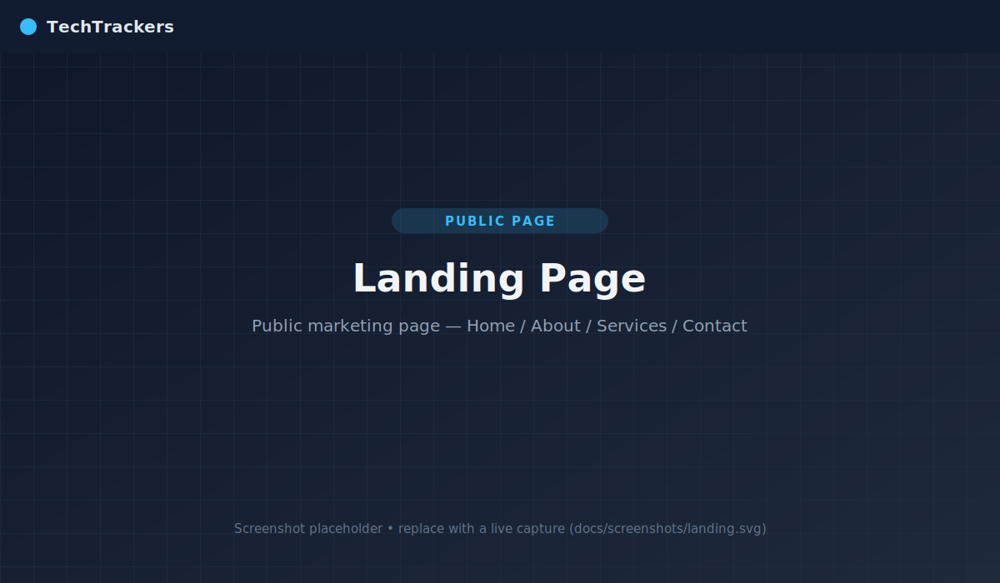 | 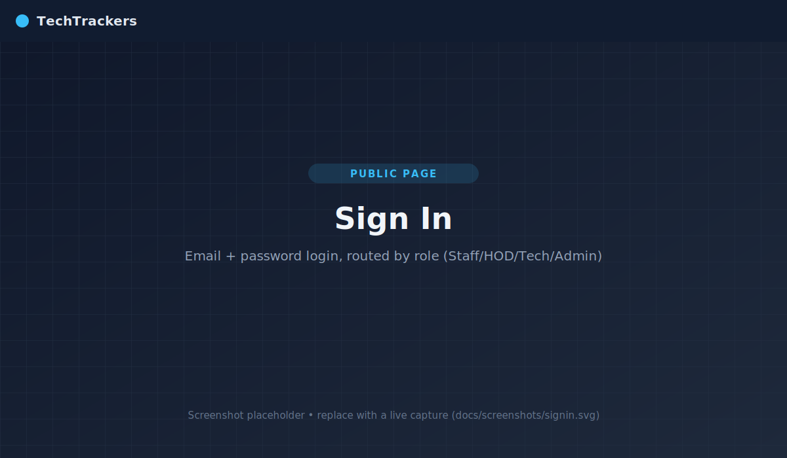 |

| Registration | Forgot Password |
|:---:|:---:|
| 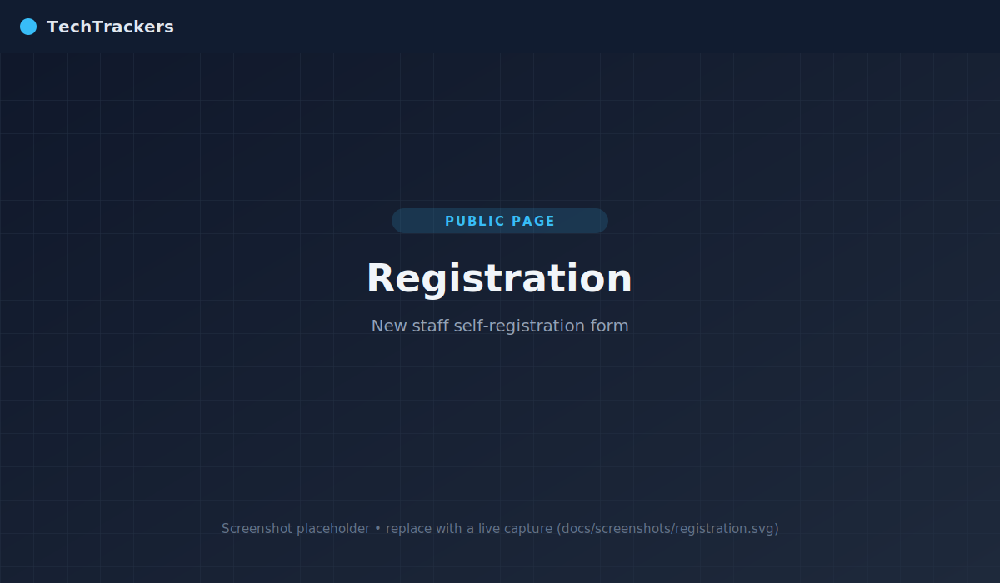 | 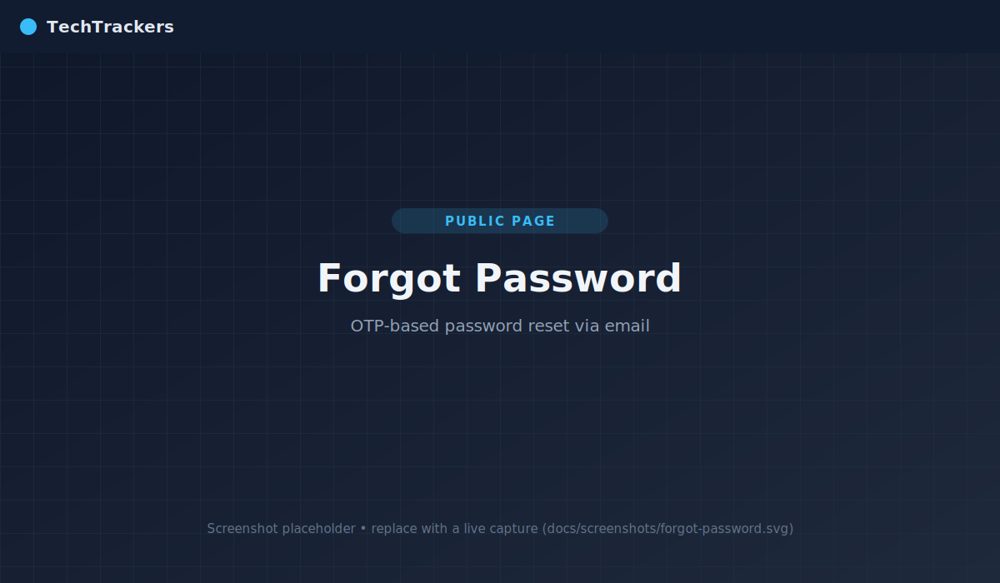 |

### Authenticated pages (require the API + database)

| Staff Dashboard | Technician Dashboard |
|:---:|:---:|
| 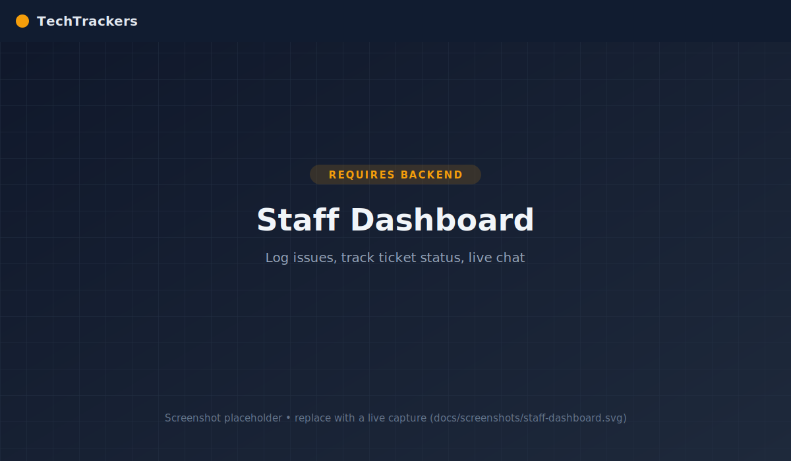 | 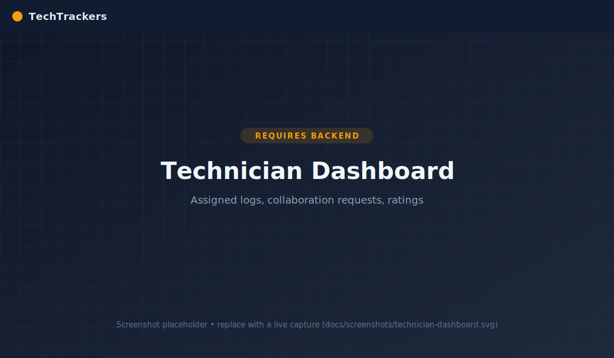 |

| Admin Dashboard | HOD — Reports |
|:---:|:---:|
| 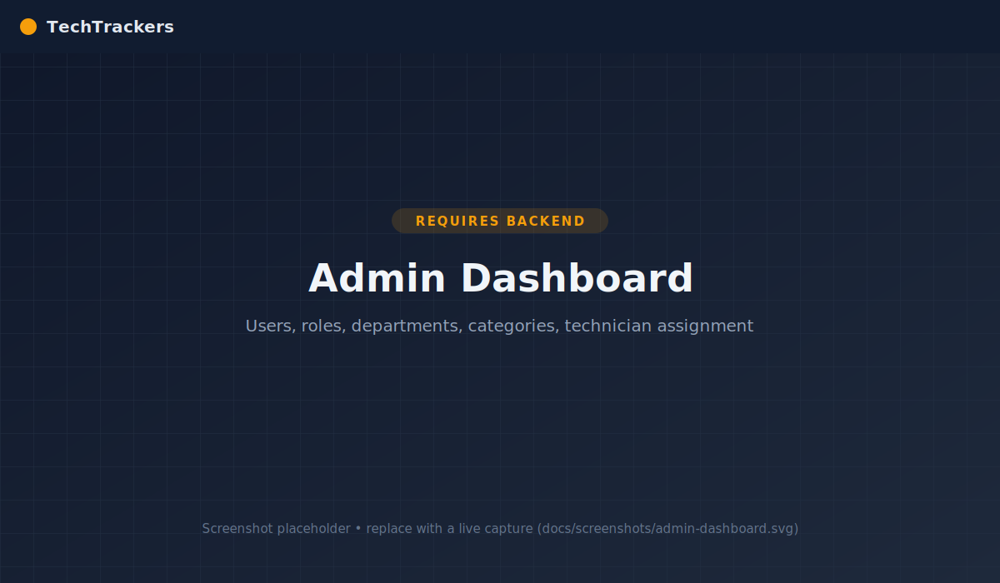 |  |

| Live Chat |
|:---:|
| 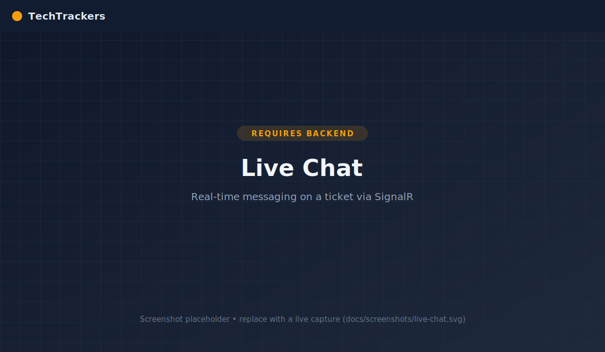 |

---

## 🧰 Tech Stack

### Frontend (`Techtrackers.Web`)
- **React 18** (Create React App / `react-scripts` 5)
- **React Router DOM 6** for routing
- **Axios** for HTTP, **@microsoft/signalr** for real-time chat
- **MUI (Material UI) 6**, **React-Bootstrap / Bootstrap 5**, **MDB React**, Emotion
- **Chart.js + react-chartjs-2** for report charts
- **jsPDF + jspdf-autotable** and **xlsx** for report exports
- **react-hook-form**, **react-toastify / react-hot-toast**, **lucide-react**, **FontAwesome**

### Backend (`TechTrackers.API`)
- **ASP.NET Core 8** Web API (C#, nullable + implicit usings enabled)
- **Entity Framework Core 9** (SQL Server provider) with retry-on-failure
- **SignalR** hub for live chat
- **Swashbuckle / Swagger** for API docs
- **JWT Bearer** package referenced (auth scaffolding)
- Layered into three projects: **API → Service → Data**

### Data
- **SQL Server** (default: `(localdb)\MSSQLLocalDB`, database `TechnicalSupportDb`)
- EF Core **code-first migrations** (3 migrations included)

---

## 🏗️ Architecture

TechTrackers follows a classic layered architecture. The React SPA talks to the Web API over REST + a SignalR WebSocket; the API delegates to a service layer, which uses EF Core to reach SQL Server.

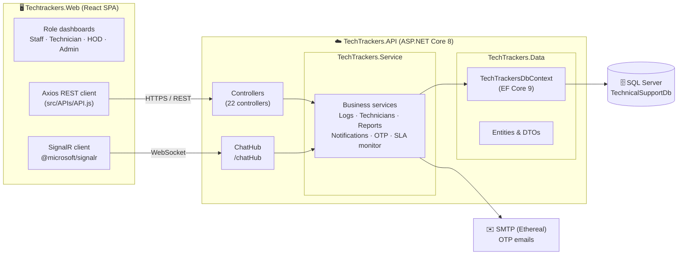

**Request lifecycle (log an issue):** Staff submit the log form → `POST /api/Log/CreateLog` → `LogController` → `LogService` persists via `TechTrackersDbContext` → notifications are raised → admins assign a technician → status transitions flow back to the reporter through notifications and live chat.

---

## 📁 Folder Structure

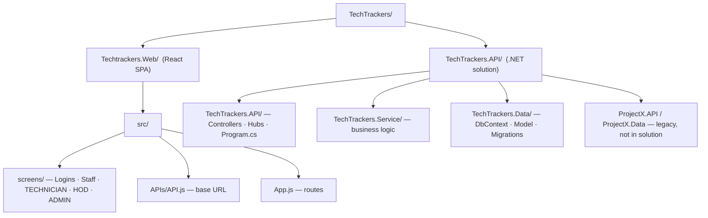

<details>
<summary><strong>Annotated tree (click to expand)</strong></summary>

```
TechTrackers/
├── Techtrackers.Web/                 # React frontend (Create React App)
│   ├── public/
│   ├── src/
│   │   ├── App.js                    # Router: public routes + /*dashboard routes
│   │   ├── index.js
│   │   ├── APIs/
│   │   │   └── API.js                # export const api = 'https://localhost:44328/api/'
│   │   └── screens/
│   │       ├── Logins/               # Landing, SignIn, Registration, ForgotPassword, About…
│   │       ├── Staff/                # Staff dashboard, log form, issue tracker, live chat
│   │       ├── TECHNICIAN/           # Technician dashboard, collaboration, ratings
│   │       ├── HOD/                  # Head-of-Department dashboard + GenerateReport/
│   │       └── ADMIN/                # Admin dashboard, user/role/department/category mgmt
│   └── package.json
│
└── TechTrackers.API/                 # .NET solution root (TechTrackers.API.sln)
    ├── TechTrackers.API/             # Web API project (startup)
    │   ├── Controllers/              # 22 controllers (see API Reference)
    │   ├── Hubs/ChatHub.cs           # SignalR hub → /chatHub
    │   ├── Program.cs                # DI, CORS, EF, SignalR, Swagger
    │   ├── appsettings.json          # connection string + SMTP
    │   └── Properties/launchSettings.json
    ├── TechTrackers.Service/         # Service layer (logs, reports, notifications, OTP, SLA)
    ├── TechTrackers.Data/            # EF Core: DbContext, Model/, Model/dto/, Migrations/
    └── ProjectX.API / ProjectX.Data/ # Legacy projects (not referenced by the .sln)
```
</details>

---

## 🗃️ Data Model

Core entities managed by `TechTrackersDbContext` and their key relationships:

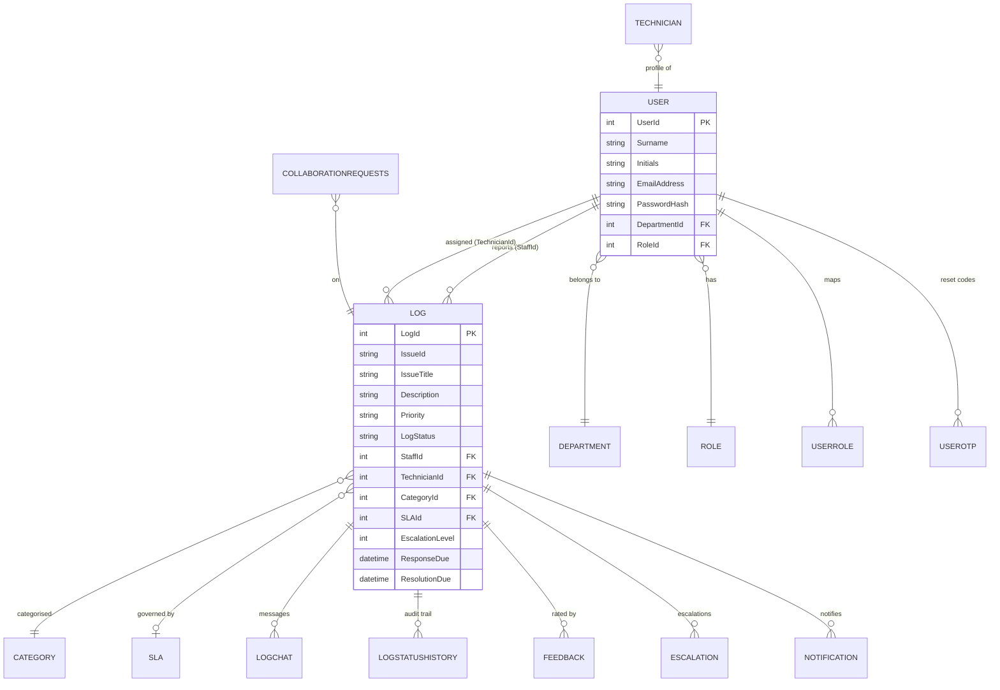

Entities: `User`, `Role`, `UserRole`, `UserOtp`, `Department`, `Category`, `SLA`, `Log`, `LogChat`, `LogStatusHistory`, `Feedback`, `Escalation`, `Notification`, `Technician`, `CollaborationRequests`.

---

## 🚀 Getting Started

### Prerequisites

| Tool | Version | Notes |
|------|---------|-------|
| [.NET SDK](https://dotnet.microsoft.com/download) | **8.0+** | Required to build/run the API |
| [Node.js](https://nodejs.org/) | **18+** (tested on 24) | Required for the React app |
| SQL Server | LocalDB **or** a full instance | Connection string targets `(localdb)\MSSQLLocalDB` by default |
| [EF Core tools](https://learn.microsoft.com/ef/core/cli/dotnet) | `dotnet tool install --global dotnet-ef` | For applying migrations |

<a id="known-environment-gaps"></a>
> ### ⚠️ Known environment gaps (documentation machine)
> These were observed while documenting the project and may apply to a fresh checkout:
> - **.NET SDK not installed** — `dotnet` was unavailable, so the API could not be built or run and migrations could not be applied. Install the .NET 8 SDK first.
> - **LocalDB not present** — the default connection string uses `(localdb)\MSSQLLocalDB`, but only full SQL Server instances (`MSSQLSERVER`, `SQLEXPRESS`) were found. Either install SQL Server Express LocalDB, or edit the connection string (see [Configuration](#-configuration)) to point at an available instance, e.g. `Server=localhost;` or `Server=.\SQLEXPRESS;`.
> - **Frontend/back-end URL mismatch** — the frontend calls `https://localhost:44328/api/` (the IIS Express SSL port), while `dotnet run` (Kestrel) serves on `https://localhost:7262` / `http://localhost:5276`. Run the API under **IIS Express**, or update `src/APIs/API.js` to match your chosen Kestrel URL. CORS currently allows only `http://localhost:3000–3002`.

### 1. Clone

```bash
git clone <your-repo-url> TechTrackers
cd TechTrackers
```

### 2. Database + Backend

```bash
cd TechTrackers.API              # solution root
dotnet restore
dotnet ef database update \
  --project TechTrackers.Data \
  --startup-project TechTrackers.API   # creates TechnicalSupportDb & applies 3 migrations

# Run the API
cd TechTrackers.API              # the Web API project
dotnet run                       # Kestrel → https://localhost:7262  |  http://localhost:5276
                                 # Swagger UI → /swagger
```

> To match the frontend's expected URL (`https://localhost:44328`), launch the **IIS Express** profile from Visual Studio instead of `dotnet run`, **or** change the base URL in `src/APIs/API.js`.

### 3. Frontend

```bash
cd Techtrackers.Web
npm install
npm start                        # Create React App dev server → http://localhost:3000
```

The app opens at **http://localhost:3000**. Public pages (Landing, Sign In, Registration) work immediately; authenticated dashboards require the API and a seeded user.

---

## ⚙️ Configuration

All backend configuration lives in `TechTrackers.API/TechTrackers.API/appsettings.json`.

| Key | Default | Purpose |
|-----|---------|---------|
| `ConnectionStrings:TechnicalSupportDb` | `Server=(localdb)\MSSQLLocalDB;Database=TechnicalSupportDb;Trusted_Connection=True;MultipleActiveResultSets=true;` | EF Core SQL Server connection |
| `Ethereal:SmtpServer` | `smtp.ethereal.email` | SMTP host for OTP emails |
| `Ethereal:Port` | `587` | SMTP port |
| `Ethereal:SenderEmail` / `Username` | *(Ethereal test inbox)* | Sender / auth user |
| `Ethereal:Password` | *(test credential)* | SMTP password |
| `Logging:LogLevel:Default` | `Information` | Base log level |
| `AllowedHosts` | `*` | Permitted hosts |

**Frontend base URL** is set in `Techtrackers.Web/src/APIs/API.js`:

```js
export const api = 'https://localhost:44328/api/';
```

> ### 🔐 Security note
> The repository's `appsettings.json` contains **committed SMTP credentials** (an Ethereal test inbox). Even though Ethereal is a throwaway testing service, secrets should not live in source control. Before any real deployment: move these to **user-secrets**, environment variables, or a secrets manager, and rotate them. The same applies to production connection strings. Note also that `PasswordHash` is stored on `User`, so ensure a real hashing scheme is used for credentials.

---

## 📚 API Reference

Base path: `/api`. Most controllers use the convention `api/{Controller}/{Action}`; several actions add an explicit sub-route, which produces the combined paths shown below (these match the URLs the frontend actually calls). Interactive docs are available at **`/swagger`** when running in Development.

### 🔑 Authentication & Account

| Method | Endpoint | Purpose | Body |
|--------|----------|---------|------|
| `POST` | `/api/User/login` | Log in; response message is role-specific and drives dashboard routing | `{ "email", "password" }` |
| `POST` | `/api/Account/RequestOtp/request-otp` | Email a one-time PIN to start a password reset | `{ "email" }` |
| `POST` | `/api/Account/VerifyOtp/verify-otp` | Verify a submitted OTP | `{ "email", "otp" }` |
| `POST` | `/api/Account/ResetPassword/reset-password` | Set a new password using a valid OTP | `{ "email", "otp", "newPassword" }` |

<details>
<summary>Sample — <code>POST /api/User/login</code></summary>

**Request**
```json
{ "email": "admin@techtrackers.com", "password": "P@ssw0rd!" }
```
**Response `200 OK`**
```json
{
  "message": "Welcome Admin",
  "user": { "userId": 1, "surname": "Doe", "roles": ["Admin"] }
}
```
**Response `401 Unauthorized`**
```json
{ "message": "Invalid credentials" }
```
</details>

### 📝 Logs (tickets)

| Method | Endpoint | Purpose |
|--------|----------|---------|
| `POST` | `/api/Log/CreateLog` | Create a log (multipart form — supports file attachment) |
| `GET`  | `/api/Log/GetLogsForStaff?userId={id}` | Logs reported by a staff member |
| `GET`  | `/api/Log/GetLogsTechnician?userId={id}` | Logs assigned to a technician |
| `POST` | `/api/Log/AssignTechnician` | Assign a technician to a log |
| `GET`  | `/api/Log/GetEscalationResults?logId={id}` | Escalation results for a log |
| `GET`  | `/api/Log/GetNotifications/{userId}?onlyUnread={bool}` | User notifications |

<details>
<summary>Sample — <code>POST /api/Log/CreateLog</code> (multipart/form-data)</summary>

**Form fields**
```
Issue_Title:  "Printer offline on 3rd floor"
Category_ID:  4
Department:   "Finance"
Priority:     "HIGH"
Description:  "The shared HP printer won't connect."
Location:     "HQ / Floor 3"
Staff_ID:     12
AttachmentFile: <file>
```
**Response `200 OK`**
```json
{ "message": "Log created successfully", "logId": 87, "issueId": "LOG-2026-0087" }
```
</details>

### 🗂️ Manage Logs

| Method | Endpoint | Purpose |
|--------|----------|---------|
| `GET` | `/api/ManageLogs/CountAllLogs` | Total log count |
| `GET` | `/api/ManageLogs/CountLogsByStatus/{status}` | Count by status |
| `GET` | `/api/ManageLogs/GetOpenLogs` | All open logs |
| `GET` | `/api/ManageLogs/GetIssue/{id}` | Single log detail |
| `PUT` | `/api/ManageLogs/OpenLog/{logId}` | Re-open a log |
| `PUT` | `/api/ManageLogs/CloseLog/{logId}` | Close a log |
| `PUT` | `/api/ManageLogs/ChangeLogStatus/{issueId}/{newStatus}` | Transition status (optional detail body) |

### 👷 Technicians

| Method | Endpoint | Purpose |
|--------|----------|---------|
| `GET`    | `/api/Technician/GetAll` | All technician users |
| `POST`   | `/api/TechnicianHandler/AddTechnician/add` | Create an internal technician |
| `GET`    | `/api/TechnicianHandler/GetTechnicians` | List technicians |
| `GET`    | `/api/TechnicianHandler/GetTechnician/{id}` | Technician by id |
| `PUT`    | `/api/TechnicianHandler/UpdateTechnician/{id}` | Update technician |
| `DELETE` | `/api/TechnicianHandler/DeleteTechnician/{id}` | Delete technician |
| `POST`   | `/api/ExternalTechnicianHandler/AddExternalTechnician/add` | Create an external technician |
| `GET`    | `/api/Tech/CountResolvedLogs/{technicianId}/countResolved` | Resolved count |
| `GET`    | `/api/Tech/CountInProgressLogs/{technicianId}/countInProgress` | In-progress count |
| `GET`    | `/api/Tech/CountOnHoldLogs/{technicianId}/countOnHold` | On-hold count |
| `GET`    | `/api/Tech/CountPendingLogs/{technicianId}/countPending` | Pending count |

### 🤝 Collaboration

| Method | Endpoint | Purpose | Body |
|--------|----------|---------|------|
| `POST` | `/api/Collaboration/Request` | Invite a technician to collaborate on a log | `{ "logId", "requestingTechnicianId", "invitedTechnicianId" }` |
| `PUT`  | `/api/Collaboration/Respond/{collaborationId}` | Accept / decline an invitation | `{ ...response... }` |
| `GET`  | `/api/Collaboration/Pending/{technicianId}` | Pending invitations for a technician |  |
| `GET`  | `/api/Collaboration/List/{technicianId}` | Collaborations for a technician |  |

### 💬 Live Chat (+ SignalR)

| Method | Endpoint | Purpose |
|--------|----------|---------|
| `POST` | `/api/LiveChat/SendMessage` | Persist and broadcast a message |
| `GET`  | `/api/LiveChat/GetMessages/{logId}` | Message history for a log |
| `WS`   | `/chatHub` | SignalR hub for real-time delivery |

### 🔔 Notifications

| Method | Endpoint | Purpose |
|--------|----------|---------|
| `GET`  | `/api/NewNotification/{userId}/staged?showUnread={bool}` | Staged notifications for a user |
| `POST` | `/api/NewNotification/markAsRead/{notificationId}` | Mark one as read |

### 💯 Feedback

| Method | Endpoint | Purpose | Body |
|--------|----------|---------|------|
| `POST` | `/api/Feedback/SubmitFeedback` | Rate & comment on a resolved log | `{ "log_ID", "user_ID", "rating", "comment" }` |
| `GET`  | `/api/Feedback/GetFeedbackByLog/{logId}` | Feedback for a log |  |

### 🏢 Departments

| Method | Endpoint | Purpose |
|--------|----------|---------|
| `GET`    | `/api/CRUDDepartment/GetAllDepartments` | List departments |
| `GET`    | `/api/CRUDDepartment/GetDepartmentById/{id}` | Department by id |
| `POST`   | `/api/CRUDDepartment/AddDepartment` | Create department |
| `PUT`    | `/api/CRUDDepartment/UpdateDepartment/{id}` | Update department |
| `DELETE` | `/api/CRUDDepartment/DeleteDepartment/{id}` | Delete department |

### 📊 Reports

| Method | Endpoint | Purpose |
|--------|----------|---------|
| `GET` | `/api/GenerateReport/GetIssueByStatusReport` | Issues grouped by status |
| `GET` | `/api/GenerateReport/GetIssueStatusCount` | Aggregate status counts |
| `GET` | `/api/MonthlySummaryReport/GetMonthlySummaryReport` | Monthly summary |
| `GET` | `/api/TechPerformanceReport/GetTechnicianPerformanceReport` | Technician performance |
| `GET` | `/api/AdminLog/GetLogs` | All logs (admin detail view) |
| `GET` | `/api/AdminLog/GetAdminLoggedIssues/admin/{adminId}` | Issues logged by an admin |

---

## 📦 Deployment

The repository includes an **AWS Elastic Beanstalk** artifact folder (`TechTrackers.API/.elasticbeanstalk/`) and a `publish/` output, indicating the API is intended for Elastic Beanstalk (or any host that runs an ASP.NET Core 8 app).

**Backend (generic):**
```bash
cd TechTrackers.API/TechTrackers.API
dotnet publish -c Release -o ./publish
# deploy ./publish to your host (IIS, Elastic Beanstalk, Azure App Service, a container, …)
```
- Set `ConnectionStrings:TechnicalSupportDb` and `Ethereal:*` via environment variables / secrets on the host — **do not** ship the committed development values.
- Update the **CORS origins** in `Program.cs` to include your deployed frontend URL.

**Frontend:**
```bash
cd Techtrackers.Web
npm run build          # produces an optimized static bundle in ./build
# host ./build on any static host (S3 + CloudFront, Nginx, Netlify, …)
```
- Point `src/APIs/API.js` at the deployed API URL before building.

---

## 🗺️ Roadmap

- [ ] **Authentication hardening** — issue and validate the referenced **JWT** tokens; protect endpoints with `[Authorize]` and role policies (login currently returns a role message without a token).
- [ ] **Secrets management** — remove committed SMTP credentials; adopt user-secrets / environment variables and rotate.
- [ ] **Unify configuration** — reconcile the frontend base URL (`:44328`) with the Kestrel ports and widen/parametrise CORS.
- [ ] **Tidy the route conventions** — drop the doubled action segments (e.g. `…/RequestOtp/request-otp`) for cleaner, RESTful URLs.
- [ ] **Remove legacy code** — delete or archive the unused `ProjectX.*` projects.
- [ ] **Automated tests** — unit tests for the service layer; integration tests for controllers; component tests for the SPA.
- [ ] **CI/CD** — GitHub Actions to build, test, and publish both apps (a `.github/workflows` folder already exists).
- [ ] **Consistent casing** — align folder names (`Techtrackers.Web` vs `TechTrackers.API`).
- [ ] **Environment config for the SPA** — replace the hard-coded API URL with `.env` (`REACT_APP_API_URL`).

---

## 🤝 Contributing

Contributions are welcome!

1. Fork the repository and create a feature branch: `git checkout -b feature/my-feature`.
2. Follow the existing code style (C# nullable-enabled; React function components).
3. Run both apps locally and verify your change end-to-end.
4. Commit with a clear message and open a Pull Request describing the change and its motivation.

For significant changes, please open an issue first to discuss the approach.

---

## 📄 License

Released under the **MIT License**. Add a `LICENSE` file at the repository root if one is not already present.

---

<div align="center">

**TechTrackers** — turning technical chaos into tracked, resolved, and reported work.

_Built with ASP.NET Core, React, and EF Core._

</div>
